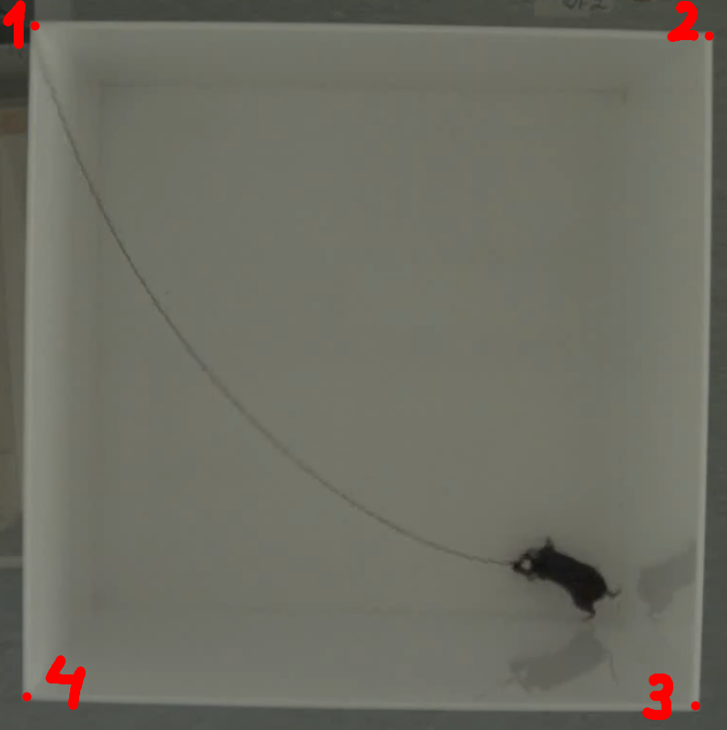
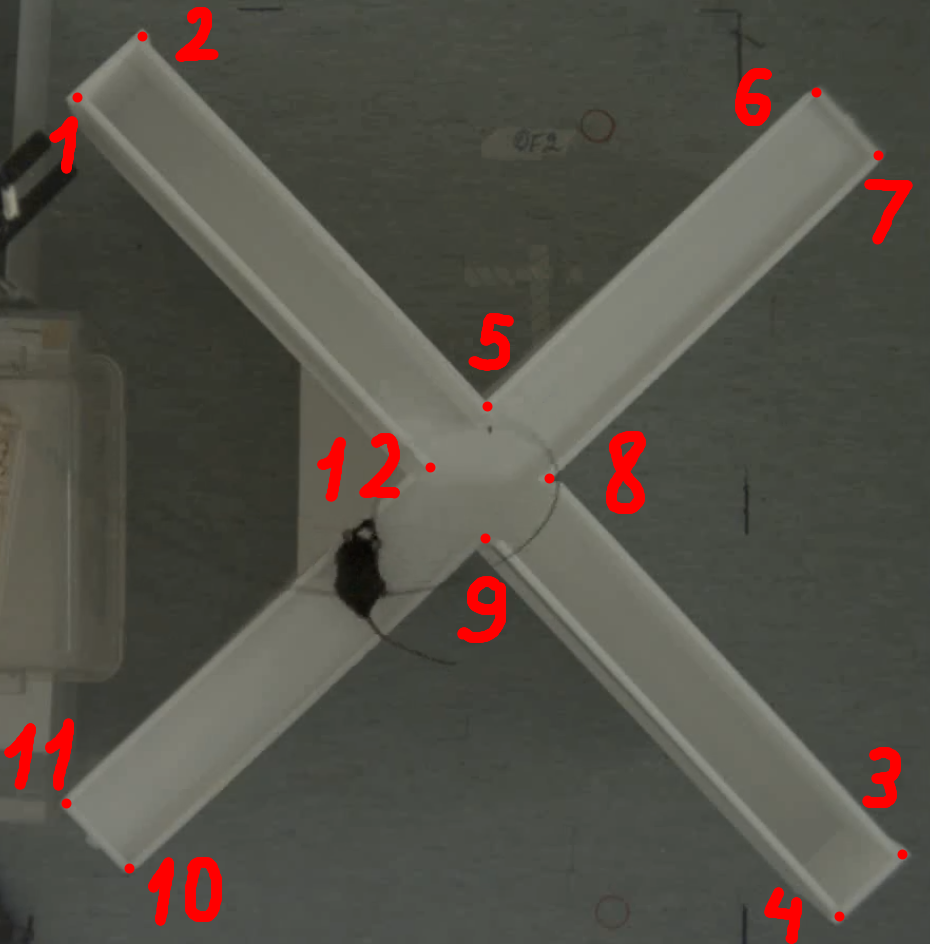
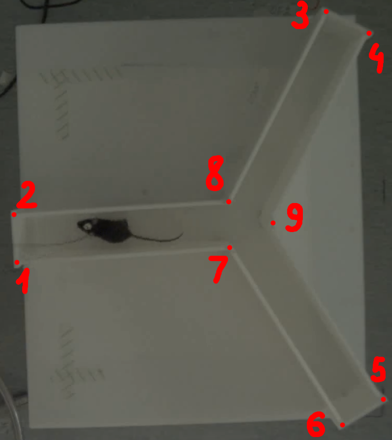

# BRATS APP

**BRATS APP** is a tool with a simple design to help analyze several behavioral mice experiments. It is created with StreamLit to make it extremely easy to use and upgrade. The tool extracts coordinates of the tracked limbs of the rodent and processes them in a readable Excel file. Then it vizualizes the results in the overview. 

The beta version of anxiety classification algorithm works for the Open Field and Elevated Maze Experiments.

## Running the App

### Choosing the experiment type

To run the app the user must choose the experiment type. The experiment type determines the model for pose and corner tracking, as well as a set of features to be derived. 

**Available experiment types** :
 - Open Field (Feature Extraction, Anxiety Classification)
 - Elevated Maze (Feature Extraction, Anxiety Classification)
 - Social Interaction (Feature Extraction)
 - Y-maze (Feature Extraction)

### Configuration

The feature extraction configurations (such as arena size, proximity distance, etc.) can be altered by clicking on *Custom* radio button. A set of video recordings can be uploaded only if the arena location is the same in every video recording.

### Running pose inference

By Default, the BRATS App runs the pose and corner estimation on the CPU. The user can change inference specification and choose to run the estimation on GPU.

Generally, pose and corner estimation on CPU takes at least twice longer time than on GPU. Therefore it is adviced to use machines with available GPUs of at least 6 GBs of memory for the best performance.

Clear cache option allows to save space on the used computer. It deletes temporary files that are created by preprocessing the video recordings (grayscaling, cutting, etc.).

In Open Field and Social Interaction experiments, some corners of the maze may not be detected properly. Thus, they are labeled manually. For the Elevated Plus Maze and Y-Maze experiments the automatic corner detection works. The order of labeling is shown in images below:

- Open Field/Social Interaction Experiment Corner Labeling Order



- Elevated Plus Maze Experiment Corner Labeling Order



- Y-Maze Experiment Corner Labeling Order



### Video uploading

The App accepts most common video recording formats including .mp4, .mpeg, .mov, and others. The user can choose as many video recordings as wanted. 

### Results

After the user selects the folder for storing output data and starts the App, the video recordings will begin to run through the pipeline in queue order. As soon as the processing is finished for a video recording, the result will appear immediately in the web browser.

The result of the video recording processing consists of several parts:
1. Resulting **.xslx** file with at least two spreadsheets (time-series and aggregate features), automatically saved into chosen directory.
2. Graphs of derived features features
3. Anxiety classification label (for the Open Field and Elevated Maze experiments only)

## SLEAP software

The pose eastimation models were trained using the software called [SLEAP](https://sleap.ai/), an open source deep-learning based framework for multi-animal pose tracking. 

Two trained models are used in the project: for the experimental arena corner tracking and bodypart tracking of the mouse.

## Software specifications
- Python 3.6
- Windows 10

## Instructions
- Download and install Python 3.6.8 through the following link (add Python to environment variables): https://www.python.org/ftp/python/3.6.8/python-3.6.8rc1-amd64.exe
- Download and install Git through the following link: https://github.com/git-for-windows/git/releases/download/v2.36.1.windows.1/Git-2.36.1-64-bit.exe
- Download and install Microsoft Visual C++ Build Tools: https://visualstudio.microsoft.com/visual-cpp-build-tools/
- (Optional/Advanced) Install CUDA Development Toolkit for enabling GPU support: https://docs.nvidia.com/cuda/cuda-installation-guide-microsoft-windows/index.html#installing-cuda-development-tools
- (Optional/Advanced) Install cuDNN for enabling GPU support: https://docs.nvidia.com/deeplearning/cudnn/install-guide/index.html#install-windows
- Download the models through the following link and place them inside the root folder of the project (there is no need to download the models if the project was received by ZIP file): https://drive.google.com/drive/folders/1JWR3P48cd5NvO7nSElnzMSmU2cWWooyH?usp=sharing
- Open the terminal window
- Run the setup.sh file as follows: `./setup.sh`
- When the installation finishes, the interface can be turned on as follows: `./run.sh`

## Project structure
```
Brain-Neuroactivity # root folder
│
└───data # models folder
│   │
│   └───classification # classification models folder
│   │   │ ...
│   │   
│   └───pose_estimation # pose and corner estimation models folder
│       │ ...
│
└───src # scripts folder
│   │
│   └───notebooks # Jupyter notebooks folder
│   │   │ ...
│   │   
│   └───pipeline # main scripts for the pipeline
│   │   │ ...
│   │   
│   └───training_scripts # training scripts folder
│       │ ...
│   
└───.gitignore # files to ignore
│   
└───config.yaml # default configurations
│   
└───README.md # instructions
│   
└───run.sh # script to run the interface
│   
└───setup.sh # script to install required packages
```

## Authors
- Team Brats
    - Amarachi Aniym
    - Ashish Dahal
    - Daria Butyrskaya
    - Farkhad Kuanyshkereyev
- Coffey Lab
    - Eleanor Coffey
    - Ye Hong
    - Jismi John
    - Anniina Jokela
    - Nikita Tiwari